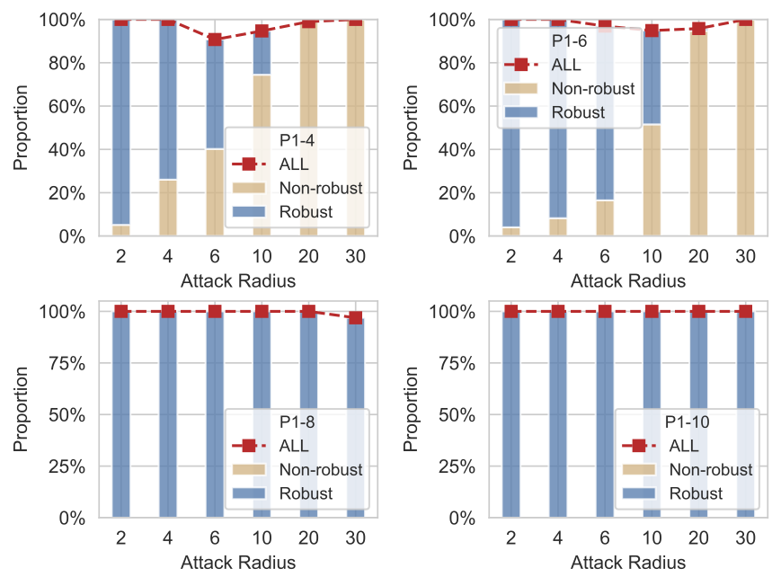

# QVIP: An ILP-based Formal Verification Approach for Quantized Neural Networks

This is the official webpage for paper *QVIP: An ILP-based Formal Verification Approach for Quantized Neural Networks*. In this paper, we make the following main contributions:

- We propose the first ILP-based verification approach for QNNs featuring both precision and efficiency.
- We implement our approach as an end-to-end tool QVIP, using the ILP-solver Gurobi for QNN robustness verification and maximum robustness radius computation.
- We conduct an extensive evaluation of QVIP, demonstrating the efficiency and effectiveness of QVIP, e.g., significantly outperforming the state-of-the-art methods.

Note that, all the QNN files used in the Table 1 from paper are given in the folder `./QNNs` , where `./QNNs/dataset_arch_in_8_qu_y.h5` denote the QNN trained using $dataset under architecture $arch with Q=y. For example P3-8 is `./QNNs/mnist_2blk_64_32_in_8_qu_8.h5` and P4-6 is  `./QNNs/fashion-mnist_1blk_64_in_8_qu_6.h5`

## Benchmarks in Sections 5.1 & 5.3:
QNNs in Section 5.1: `./QNNs/mnist_1blk_64_in_8_qu_6.h5`(P1-6)

QNNs in Section 5.3: `./QNNs/mnist_1blk_64_in_8_qu_4.h5`(P1-4) and `./QNNs/mnist_1blk_64_in_8_qu_6.h5`(P1-6)

The 100 correctly predicted samples from MNIST dataset by both P1-4 and P1-6 (shown by IDs):

```
521  342  698  106  315  76   712  931  513  252  1813 1811 1303 1032 1489 1722 1112 1757 1194 1950 
2714 2823 2247 2612 2474 2715 2492 2151 2768 2448 3655 3793 3266 3083 3356 3066 3414 3422 3600 3914 
4068 4433 4023 4847 4471 4989 4265 4700 4440 4372 5993 5336 5653 5554 5229 5569 5307 5173 5496 5290 
6656 6037 6385 6876 6760 6325 6634 6408 6722 6573 7496 7018 7892 7364 7410 7609 7458 7236 7847 7714 
8010 8481 8848 8105 8709 8454 8922 8701 8000 8587 9800 9211 9294 9459 9921 9099 9893 9927 9830 9465
```

<!-- ### MRR results for the 100 samples:

| Samples | 521  | 342  | 698  | 106  | 315  | 76   | 712  | 931  | 513  | 252  | 1813 | 1811 | 1303 | 1032 | 1489 | 1722 | 1112 | 1757 | 1194 | 1950 |
| :------ | ---- | ---- | ---- | ---- | ---- | ---- | ---- | ---- | ---- | ---- | ---- | ---- | ---- | ---- | ---- | ---- | ---- | ---- | ---- | ---- |
| P1-4    |      |      |      |      |      |      |      |      |      |      |      |      |      |      |      |      |      |      |      |      |
| P1-6    |      |      |      |      |      |      |      |      |      |      |      |      |      |      |      |      |      |      |      |      |
| Samples | 2714 | 2823 | 2247 | 2612 | 2474 | 2715 | 2492 | 2151 | 2768 | 2448 | 3655 | 3793 | 3266 | 3083 | 3356 | 3066 | 3414 | 3422 | 3600 | 3914 |
| P1-4    |      |      |      |      |      |      |      |      |      |      |      |      |      |      |      |      |      |      |      |      |
| P1-6    |      |      |      |      |      |      |      |      |      |      |      |      |      |      |      |      |      |      |      |      |
| Samples | 4068 | 4433 | 4023 | 4847 | 4471 | 4989 | 4265 | 4700 | 4440 | 4372 | 5993 | 5336 | 5653 | 5554 | 5229 | 5569 | 5307 | 5173 | 5496 | 5290 |
| P1-4    |      |      |      |      |      |      |      |      |      |      |      |      |      |      |      |      |      |      |      |      |
| P1-6    |      |      |      |      |      |      |      |      |      |      |      |      |      |      |      |      |      |      |      |      |
| Samples | 6656 | 6037 | 6385 | 6876 | 6760 | 6325 | 6634 | 6408 | 6722 | 6573 | 7496 | 7018 | 7892 | 7364 | 7410 | 7609 | 7458 | 7236 | 7847 | 7714 |
| P1-4    |      |      |      |      |      |      |      |      |      |      |      |      |      |      |      |      |      |      |      |      |
| P1-6    |      |      |      |      |      |      |      |      |      |      |      |      |      |      |      |      |      |      |      |      |
| Samples | 8010 | 8481 | 8848 | 8105 | 8709 | 8454 | 8922 | 8701 | 8000 | 8587 | 9800 | 9211 | 9294 | 9459 | 9921 | 9099 | 9893 | 9927 | 9830 | 9465 |
| P1-4    |      |      |      |      |      |      |      |      |      |      |      |      |      |      |      |      |      |      |      |      |
| P1-6    |      |      |      |      |      |      |      |      |      |      |      |      |      |      |      |      |      |      |      |      |

-->

## Robustness Verification Results in Section 5.2 (compared with the [SMT-based verifier](https://github.com/mlech26l/qnn_robustness_benchmarks))

QNNs: `./QNNs/mnist_1blk_64_in_8_qu_6.h5`(P1-6) and `./QNNs/fashion-mnist_1blk_64_in_8_qu_6.h5`(P4-6)

#### Verification Results of MNIST samples 0-99 with attack radius 1 for QNN P1-6

| Type                            | Samples   |
| :------------------------------ | --------- |
| Misclassified by P1-6 (1)       | `18`      |
| Timeout (0)                     | --        |
| Non-Robust under attack r=1 (0) | --        |
| Robust under attack r=1 (99)    | Remaining |

#### Verification Results of MNIST samples 100-199 with attack radius 2 for QNN P1-6

| Type                            | Samples           |
| :------------------------------ | ----------------- |
| Misclassified by P1-6 (1)       | `149`             |
| Timeout (0)                     | --                |
| Non-Robust under attack r=1 (4) | `104 151 158 115` |
| Robust under attack r=1 (95)    | Remaining         |

#### Verification Results of MNIST samples 200-299 with attack radius 3 for QNN P1-6

| Type                            | Samples               |
| :------------------------------ | --------------------- |
| Misclassified by P1-6 (4)       | `217 241 247 259`     |
| Timeout (0)                     | --                    |
| Non-Robust under attack r=1 (5) | `233 266 282 290 257` |
| Robust under attack r=1 (91)    | Remaining             |

#### Verification Results of MNIST samples 300-399 with attack radius 4 for QNN P1-6

| Attempt                         | Samples                           |
| :------------------------------ | --------------------------------- |
| Misclassified by P1-6 (3)       | `321 340 381`                     |
| Timeout (0)                     | --                                |
| Non-Robust under attack r=1 (8) | `303 352 376 324 359 300 386 320` |
| Robust under attack r=1 (89)    | Remaining                         |

#### Verification Results of Fashion-MNIST samples 0-99 with attack radius 1 for QNN P4-6

| Attempt                         | Samples                                  |
| :------------------------------ | ---------------------------------------- |
| Misclassified by P1-6 (13)      | `12 17 23 25 26 29 40 48 51 66 68 89 98` |
| Timeout (0)                     | --                                       |
| Non-Robust under attack r=1 (4) | `4 28 42 73`                             |
| Robust under attack r=1 (83)    | Remaining                                |

#### Verification Results of Fashion-MNIST samples 100-199 with attack radius 2 for QNN P4-6

| Attempt                         | Samples                                    |
| :------------------------------ | ------------------------------------------ |
| Misclassified by P1-6 (10)      | `107 127 145 147 150 153 163 183 192 193 ` |
| Timeout (0)                     | --                                         |
| Non-Robust under attack r=1 (5) | `136 151 135 117 166`                      |
| Robust under attack r=1 (85)    | Remaining                                  |

#### Verification Results of Fashion-MNIST samples 200-249 with attack radius 3 for QNN P4-6

| Attempt                         | Sample ID                     |
| :------------------------------ | ----------------------------- |
| Misclassified by P1-6 (7)       | `222 226 239 241 244 247 249` |
| Timeout (0)                     | --                            |
| Non-Robust under attack r=1 (3) | `248 227 219`                 |
| Robust under attack r=1 (40)    | Remaining                     |

#### Verification Results of Fashion-MNIST samples 300-349 with attack radius 4 for QNN P4-6

| Attempt                         | Samples                   |
| :------------------------------ | ------------------------- |
| Misclassified by P1-6 (6)       | `316 322 324 325 332 344` |
| Timeout (1)                     | `338`                     |
| Non-Robust under attack r=1 (6) | `313 337 311 315 312 320` |
| Robust under attack r=1 (37)    | Remaining                 |

## <span style="color: blue;">Additional Experimental Results</span>

#### Distribution of (non-)robust samples under various attack radii *r* and quantization bits *Q* for P1-*y* and P3-*y* (*y*=4, 6, 8, 10)

 &#8194; &#8194; &#8194; &#8194;                                                                                        

### MRR computation:  "Algorithm 1" vs. "Optimization-based Method"

For the benchmark, here we use three QNNs:  `./QNNs/mnist_1blk_64_in_4_qu_4.h5`, `./QNNs/mnist_1blk_64_in_6_qu_4.h5` and `./QNNs/mnist_1blk_64_in_8_qu_4.h5`(P1-4). The three QNNs are under the same architecture (784:64:10) and with totally same quantization configurations for the weights, biases and outputs of each non-input layer, while the input configurations for the three QNNs are <+, 4, 4>,  <+, 6, 6> and <+, 8, 8>  respectively. 

<!-- Note that we do not compare the  <+, 8, 8> as input configuration because almost all the computation tasks are timeout using Optimization-based Method with this input quantization. -->

Each task is run with 2 hours timeout. We set both **Step** and **StartR** parameters in *Algorithm 1* to 10 for QNN P1-4, and 5 for the other two QNNs.  The following tables give the MRR results with computation time (in seconds) using two methods, where 'TO' denotes timeout. The input samples used as benchmark are as follows:

```
698 712 931 1032 1303 1489 1722 1757 1811 1950 2151 2474 2715 2768 3066  
```

The experimental results on  `./QNNs/mnist_1blk_64_in_4_qu_4.h5` are:

| Samples                    |  698  |  712  | 931   | 1032 | 1303  | 1489   | 1722  | 1757  | 1181 | 1950 | 2151 | 2474  | 2715 | 2768  | 3066  |
| :------------------------- | :---: | :---: | :---- | ---- | ----- | ------ | ----- | ----- | -------- | -------- | -------- | ----- | ---- | :---: | ----- |
| **MRR**                    |   0   |   0   | 0     | 0    | 0     | 0      | 0     | 0     | 0        | 0        | 0        | 0     | 0    |   0   | 0     |
| **Time with Algorithm 1**  | 3.47  | 2.70  | 5.3   | 1.77 | 66.04 | 105.33 | 66.04 | 105.3 | 481.6    | TO       | 210.6    | 9.10  | 1.59 | 1,064 | 7.55  |
| **Time with Optimization** | 12.02 | 112.9 | 47.68 | 5.56 | 13.83 | 49.28  | 13.83 | 49.28 | 50.75    | 378.9    | 32.22    | 54.30 | 5.34 |  TO   | 17.41 |

The experimental results on  `./QNNs/mnist_1blk_64_in_6_qu_4.h5` are:

| Samples                     | 698   | 712   | 931   | 1032  | 1303  | 1489  | 1722  | 1757  | 1181  | 1950 | 2151  | 2474  | 2715  | 2768  | 3066  |
| :-------------------------- | ----- | ----- | ----- | ----- | ----- | ----- | ----- | ----- | ----- | -------- | ----- | ----- | ----- | ----- | ----- |
| **MRR**                     | 1     | 1     | 1     | 0     | 2     | 2     | 1     | 2     | 2     | 2        | 1     | 2     | 0     | 2     | 1     |
| **Time with Algorithm 1**   | 162.5 | 31.04 | 255.8 | 36.35 | 5,568 | 106.7 | 343.1 | 267.2 | 261.8 | 315.1    | 80.93 | 326.2 | 4.89  | 352.0 | 118.7 |
| **Time with  Optimization** | 155.2 | 62.49 | TO    | 36.59 | TO    | 338.2 | 3,901 | TO    | TO    | TO       | 190.1 | TO    | 31.63 | TO    | 1,696    |

The experimental results on  `./QNNs/mnist_1blk_64_in_8_qu_4.h5`(P1-4) are:

| Samples                     | 698   | 712  | 931   | 1032 | 1303  | 1489  | 1722  | 1757  | 1181  | 1950  | 2151  | 2474  | 2715  | 2768  | 3066  |
| :-------------------------- | ----- | ---- | ----- | ---- | ----- | ----- | ----- | ----- | ----- | ----- | ----- | ----- | ----- | ----- | ----- |
| **MRR**                     | 5     | 2    | 3     | 0    | 4     | 10    | 2     | 7     | 6     | 5     | 5     | 2     | 4     | 10    | 2     |
| **Time with Algorithm 1**   | 513.0 | 81.0 | 1,459 | 5.21 | 389.6 | 4,817 | 123.3 | 4,211 | 507.5 | 307.2 | 548.0 | 111.9 | 356.1 | 2,081 | 455.5 |
| **Time with  Optimization** | TO-   | 180.1| TO-   | 65.0 | TO    | TO    | 507.4 | TO    | TO    | TO    | TO    | 144.4 | TO    | TO-   | TO-   |

<!-- We observe that the optimization-based method is only applicable to QNNs with lower quantization bit sizes/small-scales. -->
